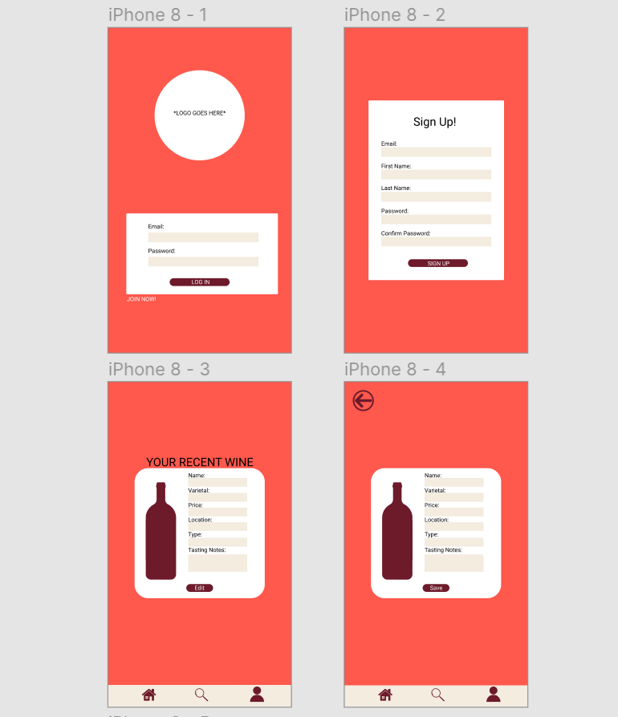

# wine down
*Cohort 35 Capstone*

## Project Overview
A journal app that tracks wine using ReactJS with CRUD capabilities.

## Challenge Statement
Often, people forget which wines they’ve tried and what they thought of it, which can make it difficult when purchasing wine. Along with this, restaurant workers tend to not have a convenient place aside from pieces of paper, that they can keep their wine notes to stay up to date on ever-changing wine lists. 

How can we help wine lovers and restaurant staff track, rate, and favorite wine tastings with on-the-go access? 

## Personas

## Wireframes and Mockups

Individually, we researched color palettes on websites such as: 

+ https://coolors.co/
+ https://color.adobe.com/create
+ http://colormind.io/

Then the UI/UX class narrowed down our options to 2 color palettes. We felt the colors in the palettes we chose were both muted and modern. We then sent the 2 palettes choices in a poll to the full stack side of the cohort to vote on. Once the votes were in we used the agreed apon colors for the website.

I used Figma and hand drawn sketches to prototype the Website: 

## User Testing
For our research we interviewed our career services and placement team here at Nashville Software School.

We also connected with local external graphic designers and senior web developers in the industry for informal feed back before finalizing our project.

## Lessons Learned

+ Observing user testing through out the creation of a project can help keep focus on areas that are important to the end user.
+ Refering to the defined user can help guide decision making.

## To Install
In the project directory, run:
`npm install`

Followed by:

`npm start`
Runs the app in the development mode.

Open http://localhost:3000 to view it in the browser.

The page will reload if you make edits.
You will also see any lint errors in the console.

Built and designed by Cohort 35 UX/UI students: Taylor Carroll, Gradi Ellis, Sage Klein, Summer Liddington, Leigh Rogers, Quin Smith, and Chandler Turner.